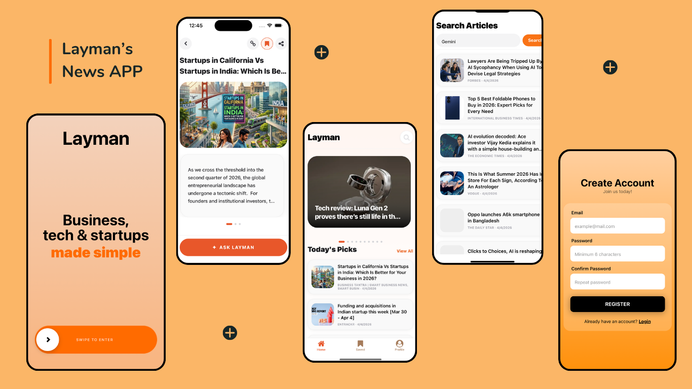

# Layman News App

<p align="center">
  
</p>

A polished React Native news app with:
- Supabase authentication (email/password)
- Featured and daily news feeds
- Saved/bookmarked articles synced to Supabase
- Search across live and saved content
- AI-powered "Ask Layman" contextual chat for each article

This project is built to satisfy the assignment requirements across:
- Part 1: Authentication (15%)
- Part 2: UI & Screens (45%)
- Part 3: Chat Module - Ask Layman (40%)

## Tech Stack
- React Native 0.79
- TypeScript
- React Navigation (Stack + Bottom Tabs)
- Supabase (`@supabase/supabase-js`)
- NewsData API
- Google Gemini API (`@google/genai`)
- AsyncStorage session persistence
- NativeWind + custom styles

## Implemented Features

### Part 1: Authentication
- Email/password sign-up with Supabase
- Email/password login with Supabase
- Persistent session management (`persistSession: true` with AsyncStorage)
- Auth-based routing (logged in users go to app stack, others to auth stack)
- Warm gradient auth UI
- Form validation + basic error handling
- Credentials loaded from environment variables (not hardcoded in source)

### Part 2: UI & Screens
- Warm, rounded, card-based visual system
- Welcome screen with gradient and swipe-to-start interaction
- Home screen:
  - Featured horizontal article carousel
  - "Today's Picks" vertical feed
- Article details with swipeable cards
- Bookmark/save article support synced to Supabase
- Search screen for news API queries
- Saved screen with in-screen search
- Bottom tab navigation (Home, Saved, Profile)
- Navigation animations and transitions

### Part 3: Ask Layman Chat
- Real AI integration using Gemini free-tier API
- Article-context-aware Q&A
- 3 AI-generated suggestion chips
- Short, simple language response style (1-2 sentence target)
- Chat UI with distinct user/bot bubbles and accent chips
- Loading/typing feedback animations

## Project Setup

### 0. Initial Commands (from scratch)
```bash
# Create a new React Native app (CLI)
npx @react-native-community/cli@latest init layman

# Move into project
cd layman

# Install JS dependencies
npm install

# Install iOS native pods
cd ios && pod install && cd ..

# Run iOS app
npm run ios
```

### 1. Prerequisites
- Node.js >= 18
- React Native Android/iOS environment set up
- CocoaPods (for iOS)

### 2. Install dependencies
```bash
npm install
```

For iOS:
```bash
cd ios && pod install && cd ..
```

### 3. Configure environment variables
Create a `.env` file in project root (or copy from `.env.example`):

```env
SUPABASE_URL=your_supabase_project_url
SUPABASE_ANON_KEY=your_supabase_anon_key
NEWS_API_KEY=your_newsdata_api_key
GEMINI_API_KEY=your_gemini_api_key
```

### 4. Run Metro
```bash
npm start
```

### 5. Run app
Android:
```bash
npm run android
```

iOS:
```bash
npm run ios
```

## Environment Configuration

| Variable | Required | Used For |
|---|---|---|
| `SUPABASE_URL` | Yes | Supabase project endpoint |
| `SUPABASE_ANON_KEY` | Yes | Supabase public anon key |
| `NEWS_API_KEY` | Yes | NewsData API requests |
| `GEMINI_API_KEY` | Yes | Ask Layman AI responses + suggestions |

Security note:
- Keep `.env` out of source control.
- Never commit live API keys.

## Supabase Configuration

### 1. Enable Auth
In Supabase Dashboard:
- Go to `Authentication > Providers`
- Enable Email provider

### 2. Create table for saved articles
Run this SQL in Supabase SQL Editor:

```sql
create table if not exists public.saved_articles (
  id bigint generated always as identity primary key,
  user_id uuid not null references auth.users(id) on delete cascade,
  article_id text not null,
  article_data jsonb not null,
  saved_at timestamptz not null default now()
);

create unique index if not exists saved_articles_user_article_idx
  on public.saved_articles (user_id, article_id);

alter table public.saved_articles enable row level security;

create policy "Users can read own saved articles"
on public.saved_articles
for select
using (auth.uid() = user_id);

create policy "Users can insert own saved articles"
on public.saved_articles
for insert
with check (auth.uid() = user_id);

create policy "Users can delete own saved articles"
on public.saved_articles
for delete
using (auth.uid() = user_id);
```

## News API Key Configuration
- Provider: NewsData.io
- Create a free account and copy API key
- Set in `.env` as `NEWS_API_KEY`

## AI API Key Configuration
- Provider: Google AI Studio (Gemini)
- Generate an API key
- Set in `.env` as `GEMINI_API_KEY`
- Current model in code: `gemini-2.5-flash-lite`

## Code Samples

### Supabase Connection Sample
```ts
import { createClient } from '@supabase/supabase-js';
import AsyncStorage from '@react-native-async-storage/async-storage';
import { SUPABASE_URL, SUPABASE_ANON_KEY } from '@env';

export const supabase = createClient(SUPABASE_URL, SUPABASE_ANON_KEY, {
  auth: {
    storage: AsyncStorage,
    autoRefreshToken: true,
    persistSession: true,
    detectSessionInUrl: false,
  },
});
```

### Gemini (Ask Layman) Sample
```ts
import { GoogleGenAI } from '@google/genai';
import { GEMINI_API_KEY } from '@env';

const ai = new GoogleGenAI({ apiKey: GEMINI_API_KEY });

export const askLayman = async (question: string, articleTitle: string) => {
  const response = await ai.models.generateContent({
    model: 'gemini-2.5-flash-lite',
    contents: `Explain simply in 1-2 sentences.\nArticle: ${articleTitle}\nQuestion: ${question}`,
    config: { maxOutputTokens: 80, temperature: 0.7 },
  });

  return response.text?.trim() ?? 'No response';
};
```


## AI Context File

For AI-assisted development context, this repository includes:
- `.cursorrules`

If needed by reviewer tooling, this can be treated as the equivalent context artifact to `codex.cursor`.
